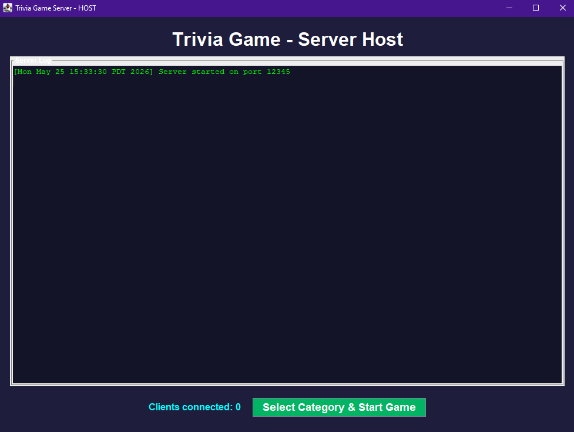
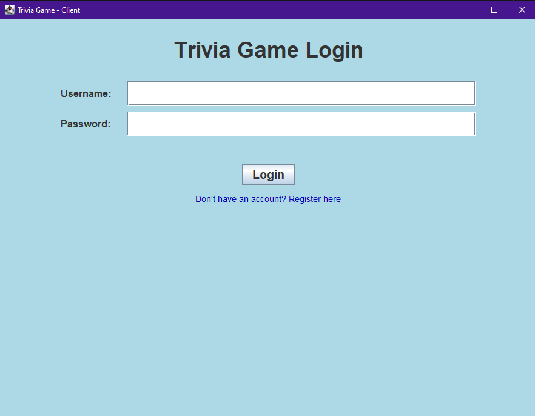
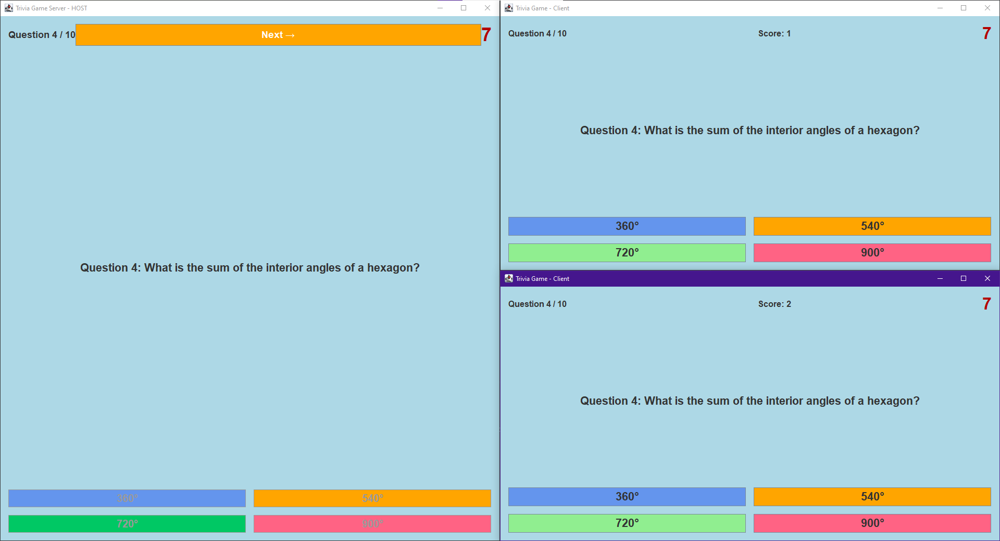
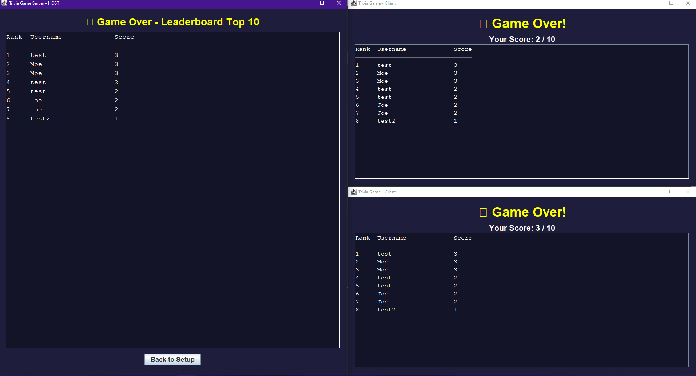

# Trivia Game - Client/Server Java Application

This project implements a multiplayer trivia game using Java sockets for client-server communication and a MySQL database for user authentication and leaderboard storage.

## Features
- User registration and login
- Multiple choice questions across categories (Math, Software, Hardware, Random)
- Real-time scoring and leaderboard
- Server-managed game state and question progression
- Swing-based GUI for server administration and client interface

## Architecture
- **GameServer**: Manages client connections, game logic, database operations, and broadcasts questions/results.
- **ClientHandler**: Handles individual client communication on the server side.
- **ClientApp**: Main client GUI for user interaction (login, registration, gameplay).
- **ServerFrame**: Server GUI for monitoring connections and controlling the game.
- **QuestionsLoader**: Loads questions from text files into memory.
- ** ClientMain / ClientMain2**: Entry points for launching the client.

## Setup Instructions

### Prerequisites
- Java Development Kit (JDK) 8 or higher
- MySQL Server
- Git (for version control)

### Database Setup
1. Start your MySQL server.
2. Execute the SQL script found in `src/sql_code.txt` to create the `userdb` database and the required tables (`users` and `leaderboard`).
   ```bash
   mysql -u root -p < src/sql_code.txt
   ```
   *Note: The script uses the default MySQL root user with no password. If your setup differs, update the credentials in `GameServer.java`.*

### Important: Security Note
The database credentials are currently hardcoded in `GameServer.java`:
```java
private static final String DB_URL = "jdbc:mysql://localhost:3306/userdb";
private static final String DB_USER = "root";
private static final String DB_PASS = "DennyXD";
```
**For security reasons, these credentials should be externalized** (e.g., using a configuration file or environment variables) in a production environment. 
This project includes a `.gitignore` file to prevent accidental commitment of configuration files containing secrets.

### Building and Running
1. Clone or download this repository.
2. Open the project in your preferred IDE (IntelliJ IDEA, Eclipse, etc.) or compile from the command line.
3. Compile all Java source files in the `src` directory.
4. Start the server by running `GameServer` (or via `ServerFrame` for GUI).
5. Launch one or more client instances by running `ClientApp`.

### How to Play
1. On the client launcher, choose to **Login** or **Register**.
2. Once logged in, wait for the server to start the game.
3. Answer multiple-choice questions by selecting A, B, C, or D.
4. Scores are updated in real-time, and a leaderboard is displayed at the end of the game.

## Screenshots
*(Placeholders - replace with actual screenshots)*

1. **Server Host Screen** showing terminal/server interface:
   

2. **Client Side** showing login/registration screen:
   

3. **Both Server and Client** during a question section:
   

4. **End Screen** showing final scores and leaderboard:
   

*Note: Create a `screenshots/` directory in the project root and add your screenshots there.*

## Project Structure
```
trivia_game/
├── src/
│   ├── ClientApp.java        # Main client GUI
│   ├── ClientHandler.java    # Handles client connections on server
│   ├── ClientMain.java       # Client entry point
│   ├── ClientMain2.java      # Alternative client entry
│   ├── GameServer.java       # Server logic and DB operations
│   ├── QuestionsLoader.java  # Loads questions from text files
│   ├── ServerFrame.java      # Server GUI
│   ├── questions_*.txt       # Question files for each category
│   └── sql_code.txt          # SQL script for database setup
├── out/                      # Compiled output (ignored by Git)
├── .gitignore                # Git ignore rules
└─── README.md                # This file
```

## Notes
- The server uses port `12345` by default. Ensure this port is open if running behind a firewall.
- All question files are plain text with pipe-delimited values: `question|optionA|optionB|optionC|optionD|answerIndex`.
- The server stores user scores in the `leaderboard` table after each game.

## Future Improvements
- Externalize database credentials using a config file or environment variables.
- Add encryption for passwords in the database (currently stored in plaintext for simplicity).
- Implement a lobby system for players to wait and chat before games start.
- Add more question categories and support for dynamic question loading.
- Enhance the GUI with better styling and responsiveness.

## License
This project is for educational purposes. Feel free to modify and extend it as needed.

---
*Developed as part of ECE 4319 Mini Project*